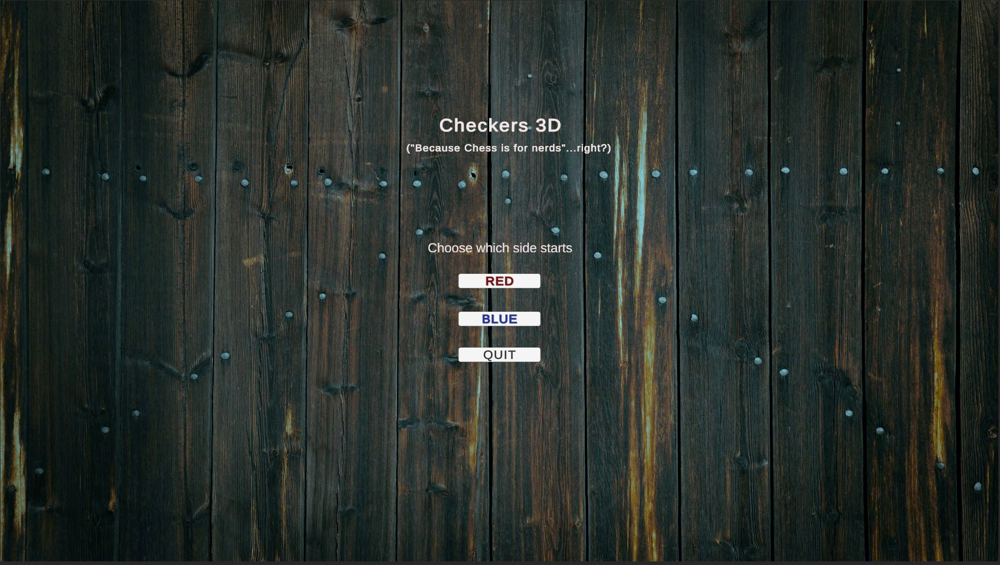
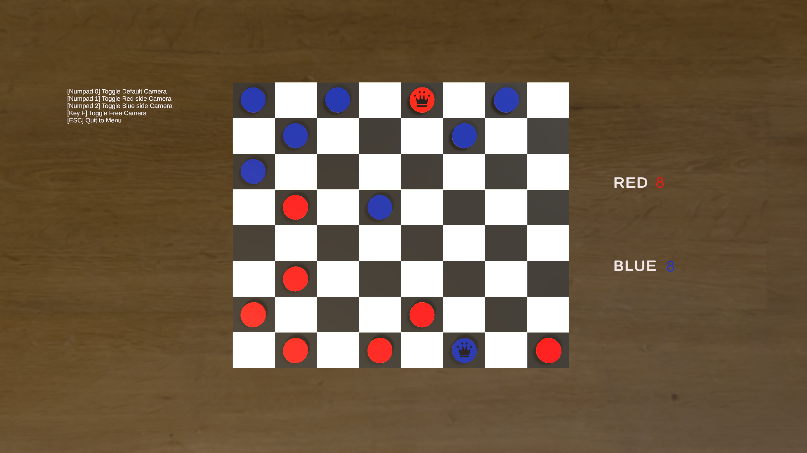
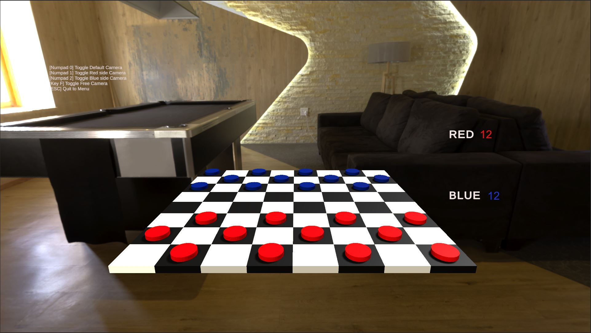
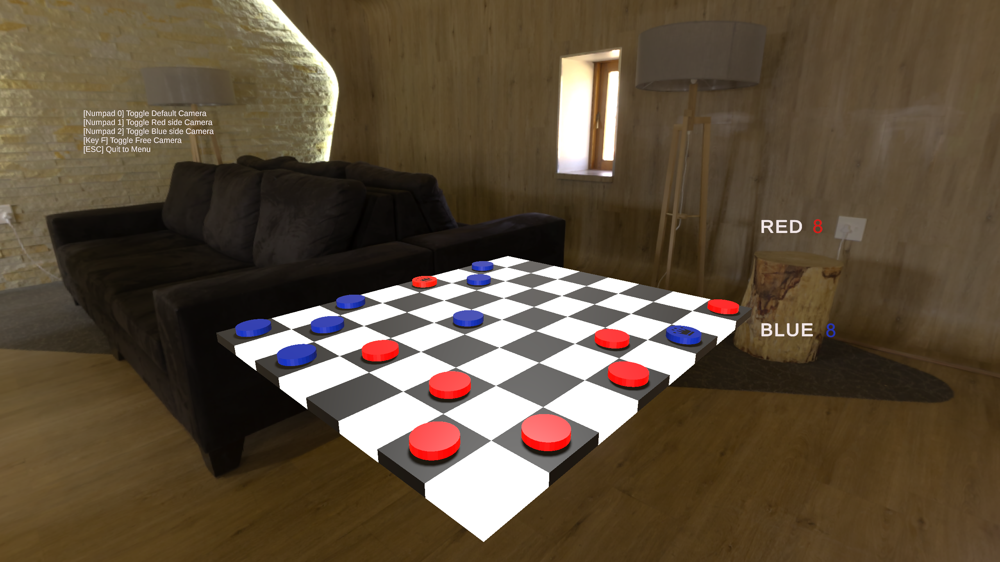

# Checkers3D

## Version 1.0

Simple 3D player versus player checkers game made with Unity

## Authors

Aleksanteri Koivisto

## Built with

* [Unity3D](https://unity3d.com/) - Game Engine
* [Microsoft Visual Studio 2022](https://visualstudio.microsoft.com/) - IDE
* [UnityCloud](https://cloud.unity.com/home/login) - Version Control
* [Blender](https://www.blender.org/) - 3D modeling

### Sources

-Menu background is from [Pixabay](https://pixabay.com/)

-Skybox HDR image is from [PolyHaven](https://polyhaven.com/hdris/skies)

## Screenshots
| 

| 

| 

| 
