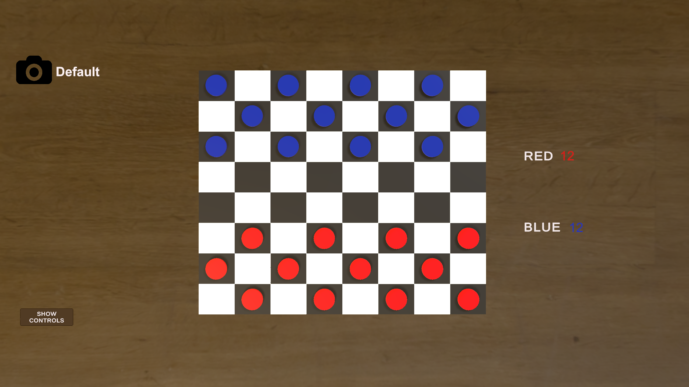

# Checkers3D

You can now download Checkers3D from Itch.io!

https://aleksanterik.itch.io/checkers-3d

## Version 1.5

Simple 3D player versus player checkers game made with Unity

New in version 1.5:

-Improved HUD and game logic

## Authors

Aleksanteri Koivisto

## Built with

* [Unity3D](https://unity3d.com/) - Game Engine
* [Microsoft Visual Studio 2022](https://visualstudio.microsoft.com/) - IDE
* [Blender](https://www.blender.org/) - 3D modeling

### Sources

-Menu background is from [Pixabay](https://pixabay.com/)

-Skybox HDR image is from [PolyHaven](https://polyhaven.com/hdris/skies)

## Screenshots

## License

-**Code License:**

C# Source files are located in Assets/Scripts

The source code in assets/scripts is licensed under the MIT License

-**Unity Engine:**

This game uses Unity game engine, which is proprietary software. Unity files (engine, library etc)
are subject to [Unity's terms of service](https://unity.com/legal).

-**Assets:**

Other assets such as art and other third party assets are not licensed under MIT unless explicitly stated